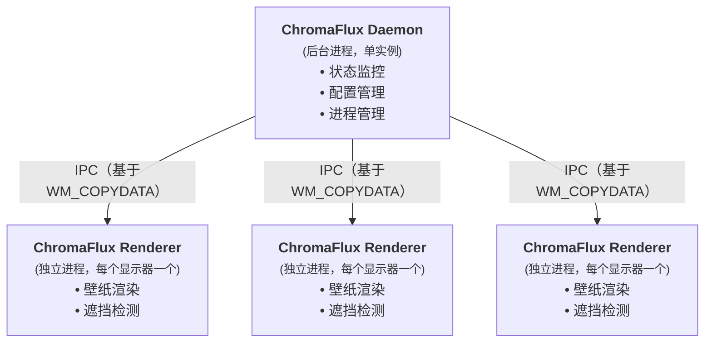

ChromaFlux
---
[](LICENSE)
[]()

The Fluid Canvas for Your Desktops.  
ChromaFlux 是一个简单的动态壁纸软件。

使用[aardio](https://www.aardio.com)开发，渲染壁纸的核心代码参考了[小风车](https://meta.appinn.net/t/topic/40295)的[aardio分支](https://github.com/Izumiko/xiaofengche/tree/aardio)。

<p align="center"></p>

## 特性
- **多显示器独立设置**：为每个显示器分配不同的壁纸，支持显示器任意排列。
- **多种格式支持**：支持常用的静态图片和动态视频格式（视频解码由libmpv提供）。
- **智能自适应**：自动检测显示器连接、分辨率、排列顺序的变化，并实时调整壁纸布局。
- **资源感知**：当桌面被其它窗口完全遮挡时，自动暂停动态壁纸渲染，降低CPU/GPU占用。
- **稳定架构**：采用守护进程 + 独立渲染进程模型，进程隔离，确保程序运行稳定性。
- **灵活使用**：支持通过命令行直接启动（控制）独立渲染进程。

## 快速开始
### 下载
前往[Releases](https://github.com/xenon2333/ChromaFlux/releases)页面下载最新的已编译版本，双击运行即可。

支持Windows 10/11系统（更低版本暂未测试）

### 基本使用
程序会先启动守护进程，在后台静默运行，然后打开控制窗口界面。

在控制窗口界面：
- 可以选择需要管理的显示器
- 为不同显示器设置不同壁纸
- 设置开机自启动/静默启动

点击应用，守护进程会根据配置加载渲染进程。

## 进阶
### 命令行参数
ChromaFlux 提供了简单的命令行接口，便于自定义脚本使用（可基于此实现壁纸轮播）。  
`ChromaFlux`大小写不敏感，但以下参数必须小写。
- `-display`：指定显示器编号，0对应主显示器
- `-filepath`：指定要加载的壁纸
- `-standalone`：独立运行，不会被守护进程接管
- `-cli`：用于向独立渲染进程发出指令
- `-silence`：静默启动守护进程，不显示控制窗口

以上参数可搭配使用，程序会忽略无效的参数搭配。  
示例：
```bash
# 为主显示器启动独立的渲染进程
# 调试使用，会被守护进程接管
chromaflux -display 0
# 独立使用，不会被守护进程接管，仅能通过cli控制
chromaflux -standalone -display 0 -filepath "E:\Wallpaper\example.mp4"

# 修改独立进程显示的位置（主显示器->副显示器1）
chromaflux -cli -display 0 -move 1

# 要求独立进程更换主显示器的壁纸
chromaflux -cli -display 0 -filepath "E:\Wallpaper\example.png"

# 停止主显示器的独立进程
chromaflux -cli -display 0 -stop
```

### 配置文件
守护进程的配置位于同目录下的`config.cfg`。  
可以手动编辑此文件来调整设置。

修改前请先退出守护进程，避免设置被覆写。
```
{
autoStart=true;
silence=true;
maxNum=4;
managed={[0]=true;[1]=false};
filepath={[1]="E:\Wallpaper\example.mp4"}
}
```

- `autoStart`：是否开机自启动
- `silence`：是否静默启动，仅针对开机自启
- `maxNum`：接管显示器的最大数量（默认为4），**只能通过配置文件覆盖**
- `managed`：需要接管的显示器编号，**键从0开始**（0对应主显示器）
- `filepath`：每个显示器要加载的壁纸路径，**键从1开始**

### 构建
如果你想自己编译 ChromaFlux ，只需下载源代码并在aardio中打开`default.aproj`，发布（F7）即可。

### 架构概览


这种架构确保了各个渲染进程互不干扰，其中一个意外退出不会影响其它进程。

## 许可证
本项目基于 GNU General Public License 2.0 开源。

## 致谢
感谢以下开源项目提供的灵感与技术支持：
- [mpv](https://mpv.io/)
- [小风车 aardio分支](https://github.com/Izumiko/xiaofengche/tree/aardio)

## 反馈
欢迎报告Bug或提出建议。
- [Issue](https://github.com/xenon2333/ChromaFlux/issues)
- [讨论](https://meta.appinn.net/t/topic/80747)
- Email：xenon2333@qq.com

## 捐助


> 该二维码由[二合一收款码（物理合并版）](https://pay-qrcode.4ce.cn/)创建。

欢迎投食\~